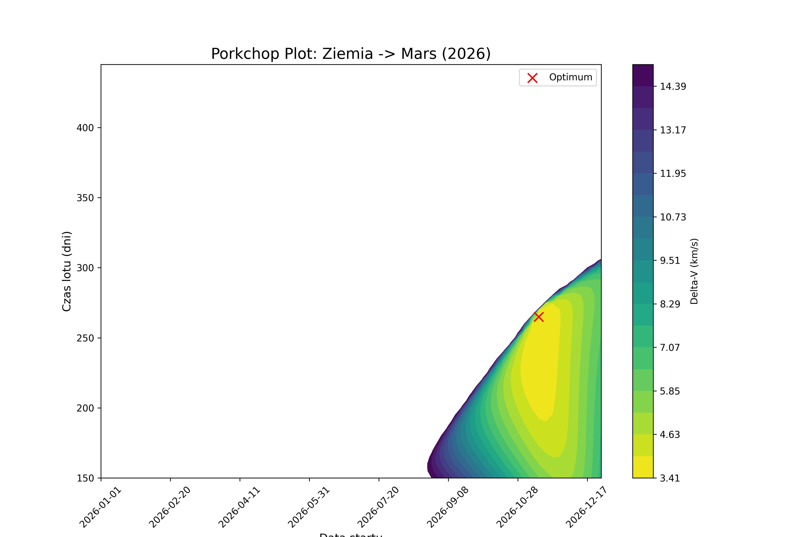

# Earth-Mars-Lambert-Transfer-Analyzer

## Overview
Earth-Mars-Lambert-Transfer-Analyzer to narzędzie służące do obliczania optymalnych trajektorii międzyplanetarnych przy użyciu metod numerycznych. Projekt implementuje rozwiązanie problemu Lamberta w celu wyznaczenia wymaganej zmiany prędkości ($\Delta v$) dla transferu balistycznego między Ziemią a Marsem. 

Głównym celem analizatora jest generowanie wykresów typu Porkchop Plot, które pozwalają na identyfikację okien startowych o najniższym koszcie energetycznym.

## Technical Features
* **Custom Lambert Solver**: Autorska implementacja oparta na metodzie zmiennych uniwersalnych (Universal Variables) oraz funkcjach pomocniczych Stumpffa. Algorytm zachowuje stabilność dla orbit eliptycznych, parabolicznych i hiperbolicznych.
* **JPL Ephemerides Integration**: Wykorzystanie biblioteki Skyfield do pobierania precyzyjnych wektorów stanu planet z bazy NASA JPL (Development Ephemeris de421).
* **Numerical Validation**: Walidacja wyników własnego solvera poprzez porównanie z algorytmem Izzo (biblioteka Poliastro). Uzyskana precyzja obliczeń wynosi rzędu $10^{-8}$ km/s.
* **Porkchop Plot Synthesis**: Automatyczne generowanie map konturowych $\Delta v$ w funkcji daty startu i czasu trwania lotu, pozwalające na optymalizację misji.

## Mathematical Foundation
Rdzeniem obliczeniowym jest rozwiązanie uniwersalnego równania czasu przelotu Lamberta:

$$\sqrt{\mu} \Delta t = \chi^3 S(z) + A\sqrt{y(z)}$$

W celu wyznaczenia parametrów orbity, program implementuje iteracyjną metodę Newtona-Raphsona, która znajduje wartość zmiennej $z$ minimalizującą różnicę między założonym a obliczonym czasem przelotu. Wykorzystanie funkcji Stumpffa (C(z) i S(z)) zapewnia ciągłość matematyczną modelu niezależnie od ekscentryczności orbity.

## Performance & Results

Analizator został poddany testom dla okien startowych w roku 2026. Narzędzie poprawnie zlokalizowało globalne minimum energetyczne, wskazując optymalny moment startu (listopad 2026) przy koszcie $\Delta v$ na poziomie około 3.41 km/s.

## Dependencies
Do poprawnego działania wymagane są następujące biblioteki Python:
* `numpy`
* `skyfield`
* `matplotlib`
* `poliastro` (wykorzystywane do walidacji wyników)
* `astropy`

## Usage
Program operuje na dwóch głównych osiach zmiennych:
1. Zakres dat startu (Launch Window).
2. Czas trwania lotu (Time of Flight).

